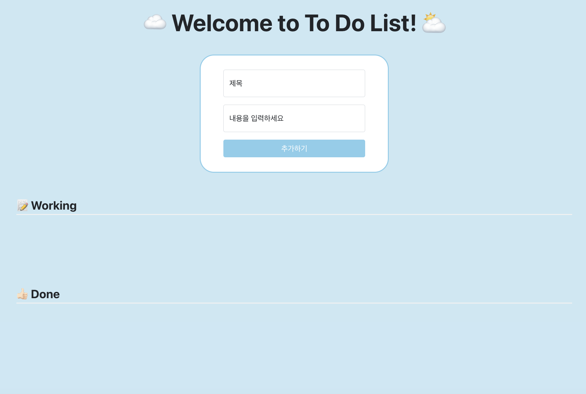

#  📝 To Do List - React Project

- 리액트\_To Do List 관리 사이트
- 주소 : https://innes-k.github.io/todo-project/

 

## 🖥️ 프로젝트 소개

할 일 목록 'To Do List'를 추가 및 관리하는 사이트 입니다.

 

## 🕰️ 개발 기간

- 2024.01.19 ~ 2024.01.22 (4일간)

### ⚙️ 개발 환경

- `React`, `HTML5`, `CSS3`
- **Framework** : Bootstrap(5.0.2)
- **environment** : Visual Studio Code, git, github

 

## ✨ 프로젝트 화면 구성 및 기능

- 메인 페이지

  

 

- 영화 상세 페이지

  

 

- 영화 검색

  

 

- 영화 카드 정렬

  

 

- 한줄평 CRUD(작성, 수정, 삭제)

  

 

- footer

  

 

## 📌 주요 기능

### 필수 구현사항

1. To Do List에 새로운 리스트 추가

   - 제목, 내용 input은 다시 빈 값으로 초기화

2. 리스트의 '완료' 버튼 클릭 시 Done 목록으로 이동

   - Done 목록의 상태 버튼은 '취소하기'로 변경

3. 공통 Layout 적용

   - 최대 넓이는 1200px, 최소 넓이는 800px, 가운데 정렬

 

### 선택 구현사항

1.  유효성 검사
   
    - 제목 미입력시

      

       

    - 내용 미입력시

      

 

## 📝 KPT 회고

### Keep (유지하고 싶은 좋았던 점)

- 필수 기능을 모두 구현한 후에도 다양한 추가 기능을 고심한 것
- 코드와 사이트를 더 나은 방향으로 발전시키기 위해 수정을 거듭한 것

 

### Problem (아쉬웠던 점)

- 추가하고 싶었던 기능들을 모두 구현하지는 못한 점
- 코드를 간결하게 작성하지 못한 점
- 마주했던 다양한 트러블 슈팅 과정들을 기록하지 못한 점

 

### Try (Problem 해결 방법, 앞으로의 다짐 등)

- 기한 내에 구현하지 못했던 선택 사항들을 리팩토링 해보기
- 트러블 슈팅을 블로그에 보다 상세하게 작성하기
